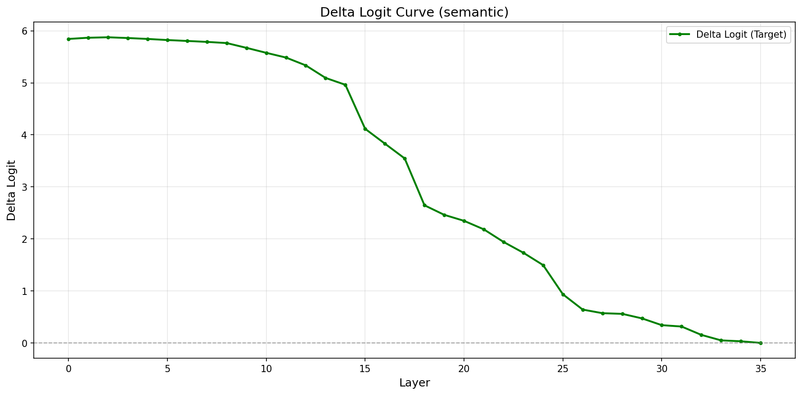

# 2.1 report

## 2. 实验一：Logit Lens

### 2.0 方法细节（如何得到每层的倾向）

**目标**：在不改模型参数的前提下，“偷看”模型在每一层如果现在就输出，会更倾向语义情绪还是韵律情绪。

**流程（逐层读出）**

1. 只取冲突样本：对每条样本有 `semantic_label` 与 `prosody_label`，并满足 `semantic_label ≠ prosody_label`（本实验共 197 条）。
2. 一次前向拿到所有层表示：获取每层每个 token 的 `hidden_states[l][t]`（l 为层号，t 为 token 位置）。
3. Readout position 的选择：我们关心生成第一个输出 token（情绪词）的倾向，因此取最后一个输入 token 位置：
    - `readout_pos = T - 1`
    - `h_l = hidden_states[l][readout_pos]`
    1. 真实输出路径读出 logits：为保证层间可比性，使用模型真实生成时的读出路径：
    - `logits_l = LMHead(FinalNorm(h_l))`
4. Restricted 5-way（只看 5 个候选情绪词）：只取 neutral/happy/sad/angry/surprised 对应 token 的 logits，避免其他词带来的噪声，同时聚焦“语义 vs 韵律”竞争。

**指标定义**

- **Win-rate**：在 5 个情绪词中，logit 最大者为该层“赢家”。统计：
    - Win Semantic：赢家 = 语义标签词 的比例
    - Win Prosody：赢家 = 韵律标签词 的比例
    - Win Other：赢家既不是语义也不是韵律标签词的比例（反映模型在冲突样本上的摇摆/不稳定）
- **Margin**（韵律相对语义的优势）：
    - $margin(l) = logit_{prosody}(l) - logit_{semantic}(l)$
    - margin > 0：更偏韵律，margin < 0：更偏语义

### 2.1 结果图

- `logit_lens/outputs/margin_curve_conflict.png`

- `logit_lens/outputs/winrate_curve_conflict.png`

### 2.2 主要观察

- **前半段层（0–22左右）**：
    - margin 接近 0（没有明显偏向），说明“语义 vs 韵律”在这一段比较混合。
- **后半段层（约 23–35）**：
    - margin 明显下降到负值，代表模型逐层更偏向“语义标签”。
- **Win-rate 曲线**：
    - 前半段“其他”占比高（模型不稳定地输出非语义/韵律目标）
    - 后半段语义赢率明显上升，韵律赢率上升较小

**总结**：
模型在后半层对“语义标签”的倾向明显增强，韵律优势不突出。

---

## 3. 实验二：Activation Patching（因果证据）

### 3.1 基本原理

目标：给出“语义信息 vs 韵律信息”对最终输出的因果影响。

核心做法：对一对样本 (A, B)，在某一层 $l$ 把 A 的音频区域表示替换成 B 的，再继续前向到输出，观察预测是否发生可解释的变化。

> 若替换后输出显著朝 B 的目标标签变化，说明该层的音频表示对该标签具有因果控制力。
> 

### 3.2 指标

对每个层 $l$，统计所有 pairs 的平均：

- **Flip to Target**：`pred_patch(l) == target` 的比例
    - semantic pair：`target = semantic_label(B)`
    - prosody pair：`target = prosody_label(B)`
- **Flip from Base**：`pred_patch(l) != pred_base` 的比例
- **Delta Logit(Target)**：目标类 logit 的提升幅度
    - $\Delta(l) = logit_{patch}(target) - logit_{base}(target)$

### 3.4 结果

结果图：

- Prosody：
    - `activation_patching/outputs/flip_rate_curve_prosody.png`
    
    
    
    - `activation_patching/outputs/delta_logit_curve_prosody.png`
    
    
    
- Semantic：
    - `activation_patching/outputs/flip_rate_curve_semantic.png`
    
    
    
    - `activation_patching/outputs/delta_logit_curve_semantic.png`
    
    
    

**Semantic patch（只换语义）**

- 早期层（0–12）：flip_to_target 很高（最高约 0.65，且多层维持在 0.5+）
- delta_logit(target) 早期很大（约 5–6），随后逐步衰减

**Prosody patch（只换韵律）**

- flip_to_target 整体较低（约 0.14–0.26），峰值在较早层（~9）
- delta_logit(target) 早期较小（~2.2–2.3），随后逐步衰减

**结论：**

1. **语义注入（semantic-only）在早层具有强定向因果控制**
2. **韵律注入（prosody-only）更多表现为扰动而非定向控制**
3. **~14–15 层是“audio span 可控性”的边界**：
    
    从这里开始仅替换 audio span 难以影响最终输出，说明信息已扩散到全局/其他位置。
    

---