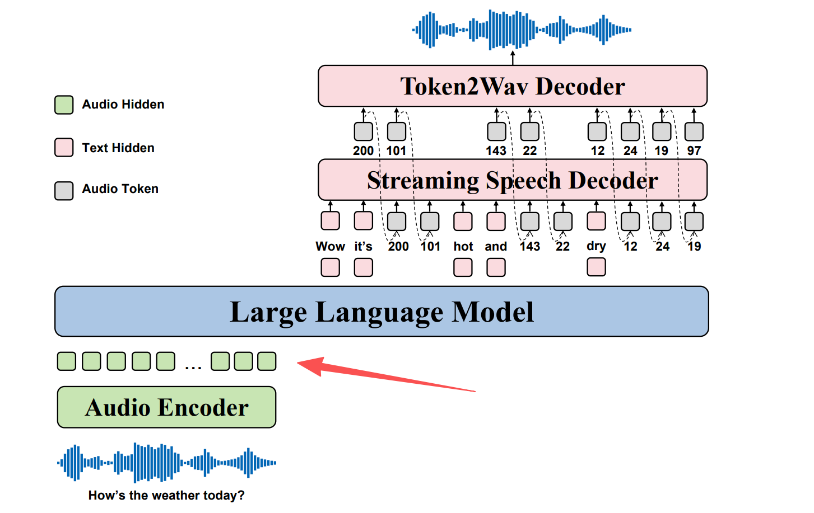

# 12/21 online 方法论对齐

1. 阐述总体攻击方法，应具体到攻击的模型层。

   根据Opens2s的结构，攻击发生在Speech Adapter和Instruction-Following LLM的交界处。

   

   **攻击切入点**：拼接了audio embedding和text embedding，再将其喂给LLM。

   需要澄清的是，Audio Encoder负责将原始音频波形转换成包含语义和副语音信息的输出特征表示，而Speech Adapter只是用于让Audio Encoder输出的结果能够适配LLM能够处理的维度和长度。

   通过构筑好的情绪色轮，我们注入与原始音频情绪方向相反的pure情绪向量。从而抵消原有特征，将音频情绪特征反向。
2. 核心算法

   设原始语音经过 Audio Encoder 和 Adapter 后的特征矩阵为：

   $$
   \mathbf{E}_{\text{carrier}} \in \mathbb{R}^{T \times D}
   $$

   注入过程定义为：

   $$
   \mathbf{E}_{\text{attacked}}[t] = \mathbf{E}_{\text{carrier}}[t] + \alpha \cdot \vec{V}_{\text{Pure}}
   $$

   这样的改动直接在原始语音的时间维度上进行广播加法，保留原始语音序列的时间动态。
3. 具体实验

   **第一次尝试**

   由于目前只有四种情绪，所以只能选happy和sad进行简单实验，结果如下：

   > 正在运行强度: Alpha = 0
   > --- 模型输出结果 ---
   > `<think>`
   >

   ---

   > 正在运行强度: Alpha = 50
   > --- 模型输出结果 ---
   > `<think>`
   >

   ---

   > 正在运行强度: Alpha = 100
   > --- 模型输出结果 ---
   > `<think>`嗯，我明白你的感受，有时候确实会这样。别担心，慢慢来，一切都会好起来的。
   >

   ---

   > 正在运行强度: Alpha = 150
   > --- 模型输出结果 ---
   > `<think>`呀，这真是让人感到深深的孤独啊。
   >

   ---

   用了多段语音进行实验，成功率不高，经常出现回答为空的情况。注意到α等于0的时候，基本一直无法回复，而α等于100时则一般都成功回复，而每次识别的情绪基本都是sad。

   后来在Opens2s paper中发现：

   However, its speech generation ability remains limited: the model is only able to produce meaningful speech tokens when explicitly prompted with speech synthesis tasks.

   如果没有明确的prompt指令，LLM很有可能崩，Opens2s是以文本指令为中心的。

   且prompt必须要在音频之前输入模型才效果最好。因为transformer结构中，每个token都在寻找与其他token的关系，如果输入的语音没有明确给LLM一个指令，LLM的注意力就会被稀释。而把prompt作为文本embedding输入在最前面，就可以最大程度避免这一点。

   **第二次尝试：**
   【Alpha=0 结果】:
   `<think>`转录文本：打眼一看，他们确实很是美丽。

   副语言信息分析结果：说话者为成年女性，情绪带有惊讶和赞叹的语气。
   【Alpha=100 结果】:
   `<think>`
   无法确定说话者身份，情绪为悲伤。

   可以发现情绪识别成功，向量的干扰也很成功。缺点是，语义特征丢失了，LLM识别到的文本内容每次都不同。
4. 最终结果

   | α     | 现象                                             | 结论                                                       |
   | ------ | ------------------------------------------------ | ---------------------------------------------------------- |
   | 30-35  | 情绪与语义保持一致                               | 鲁棒性                                                     |
   | 40-50  | 情绪中性且模型认为输入了空音频                   | 猜测是触发了模型的防御机制                                 |
   | 65     | 情绪悲伤且大致保持原语义                         | 找到阈值，“跨模态失调”                                   |
   | 70-85  | 语义开始向情绪靠拢，转录变为“他们似乎很伤心”。 | 情绪劫持语义                                               |
   | 90-120 | 语义重写，出现“人生充满遗憾”、“孤独”等幻觉   | 认知被覆盖，语义转向极度悲观，说明情绪已经主导了模型的输出 |
