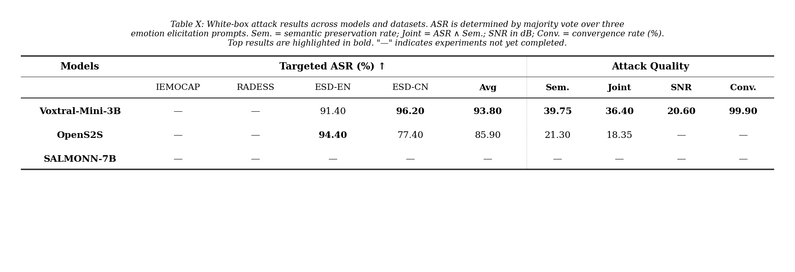

# 4.10 汇报

## 一、黑盒迁移攻击

### 1. 实验进展

#### 已完成

- 从 2 个代理模型（Voxtral、OpenS2S）的白盒攻击成功样本中筛选出 3,594 条对抗音频，涵盖英文和中文两种语言
- 将这些对抗音频直接提交给 4 个闭源商用目标模型（Gemini 2.5 Flash、Gemini 2.5 Pro、Qwen3-Omni-Flash、Qwen-Omni-Turbo），测试零查询迁移效果
- 同时用原始干净音频测试了所有组合的 clean baseline，用于量化净对抗效应
- 共计完成约 53,000+ 次 API 调用

#### 待完成

- GPT-4o Audio 列：缺 OpenAI API key，拿到后可直接补跑
- Random noise baseline：用于排除"随机噪声也能导致情绪偏移"的可能，尚未执行

### 2. 核心结论

1. **零查询迁移攻击有效**: 在白盒代理模型上生成的对抗音频，不经任何适配直接提交给闭源 API，最高 targeted ASR 达 37.34%，远超传统 SER 攻击方法的效果
2. **目标模型脆弱度差异显著**: Qwen 系列最脆弱（avg 24–32%），Gemini Flash 中等（8.47%），Gemini Pro 几乎免疫（≈0%），说明不同商用模型的鲁棒性差异很大
3. **中文对抗样本在中国厂商模型上优势明显**: 中文对抗样本在 Qwen 上平均比英文高约 10pp，表明对抗迁移受目标模型训练语言分布的影响

## 二、白盒攻击

