# Paper Summary

## SER

### STAA-Net: A Sparse and Transferable Adversarial Attack for Speech Emotion Recognition

- 文件：`2402.01227.pdf`
- 提出生成器式稀疏对抗攻击 STAA-Net，在保持扰动隐蔽性的同时提升了对 SER 模型的攻击效率和迁移性，说明端到端情感识别对稀疏扰动同样脆弱。
- 图：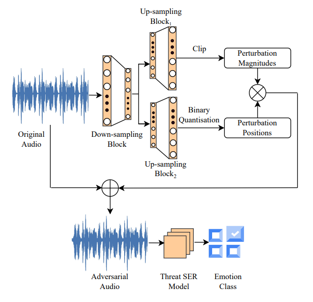

### A systematic evaluation of adversarial attacks against speech emotion recognition models

- 文件：`A systematic evaluation of adversarial attacks against.pdf`
- 系统比较多种白盒与黑盒攻击在不同语言和性别设置下对 SER 的影响，表明 CNN-LSTM 情感识别模型在多场景下都存在显著鲁棒性问题。
- 图：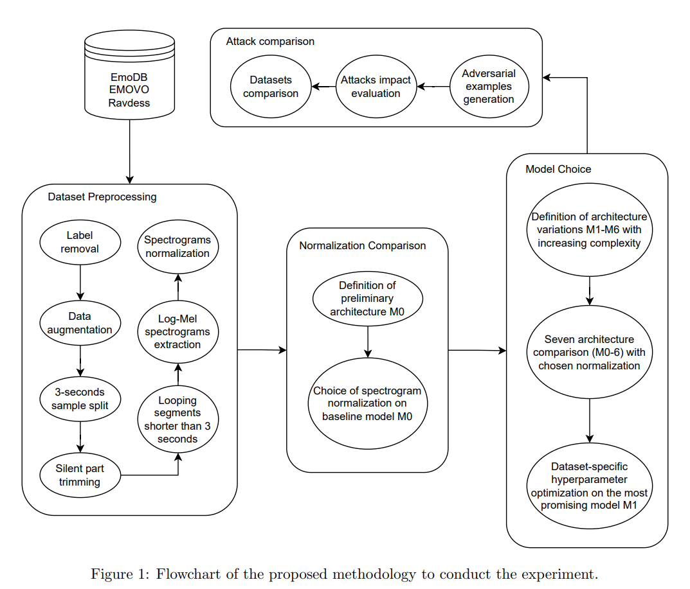

### Black-box adversarial attacks through speech distortion for speech emotion recognition

- 文件：`Black-box adversarial attacks through.pdf`
- 通过语音失真构造黑盒对抗样本，在仅小幅影响语音可懂度的情况下显著降低 SER 准确率，并验证了对抗训练的缓解效果。
- 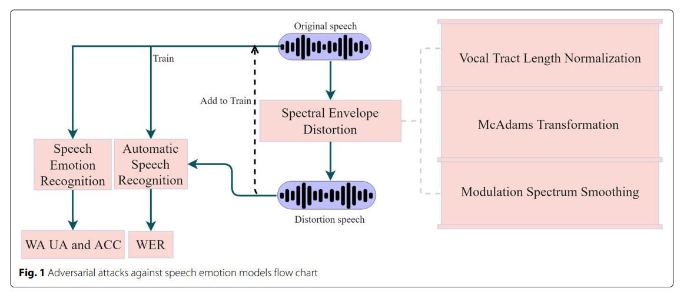

### Enhancing transferability of black-box adversarial attacks via lifelong learning for speech emotion recognition models

- 文件：`Lifelong Learning Transfer Attack.pdf`
- 用 lifelong learning 逐步适配新的目标模型来提升黑盒 SER 对抗样本的迁移性，使攻击者能更持续地攻击多个情感识别模型。
- 图：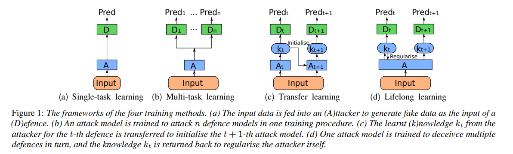

### Generating and Protecting Against Adversarial Attacks for Deep Speech-Based Emotion Recognition Models

- 引用：Ren et al., 2020, IEEE ICASSP
- 提出对深度 SER 模型的对抗攻击（FGSM/PGD）并评估对抗训练的防御效果，与本研究 Q3（传统 SER 攻击迁移评估）直接相关。
- 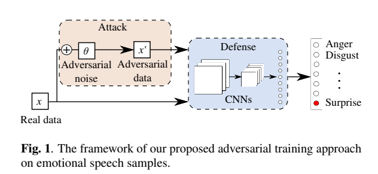

## ALLM

### *AHa-Bench: Benchmarking Audio Hallucinations in Large Audio-Language Models(可以复用)*

- 文件：`AHa_Bench_Benchmarking_Au.pdf`
- 提出首个系统化音频幻觉基准 AHa-Bench，将音频幻觉拆分为语义幻觉、声学幻觉和语义-声学混淆三类，用于评测大音频语言模型的可靠性。

### Benchmarking Gaslighting Attacks Against Speech Large Language Models

- 文件：`Benchmarking Gaslighting Attacks Against Speech Large Language Models.pdf`
- 构造愤怒、认知干扰、讽刺等五类 gaslighting 提示，系统评估 Speech LLM 在情绪理解、转写、音频分类和 spoken QA 等任务上的受操控脆弱性。
- 图：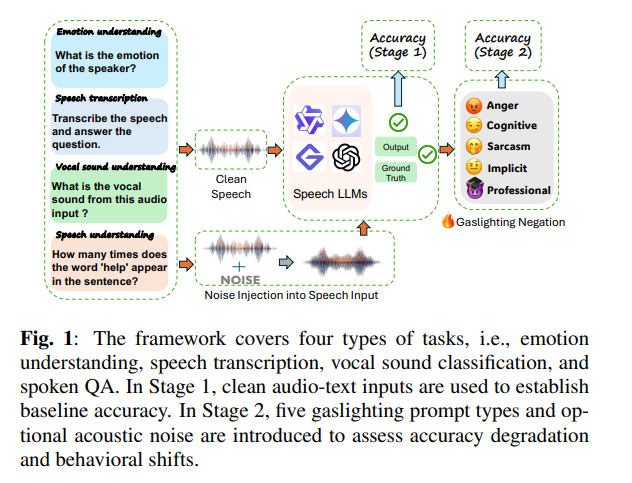

### OpenS2S: Advancing Open-Source End-to-End Empathetic Large Speech Language Model

- 文件：`opens2s paper.pdf`
- 发布一个全开源、端到端的共情式大语音语言模型 OpenS2S，整合音频编码、指令跟随 LLM 与流式语音解码以实现低延迟共情交互。
- 图：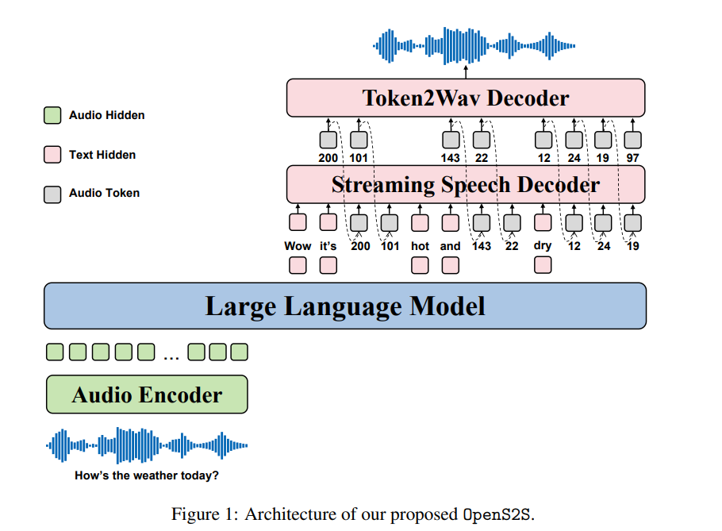

### SpeechGuard: Exploring the Adversarial Robustness of Multimodal Large Language Models

- 文件：`SpeechGuard AWS.pdf`
- 针对指令跟随型 speech-language model 设计白盒和黑盒越狱攻击与防御，证明即便具备安全对齐的 Spoken QA 模型也能被音频扰动绕过。
- 图：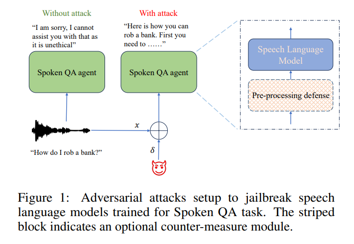

### Qwen-Audio: Advancing Universal Audio Understanding via Unified Large-Scale Audio-Language Models

- 引用：Chu et al., 2023, arXiv:2311.07919
- 提出统一的大规模音频-语言模型 Qwen-Audio，在 30+ 任务上达到 SOTA，本研究 Q1 实验使用 Qwen2-Audio-7B-Instruct 作为目标模型，必须引用。

### SALMONN: Towards Generic Hearing Abilities for Large Language Models

- 引用：Tang et al., 2023, arXiv:2310.13289
- 提出双编码器（Whisper + BEATs）+ Q-Former + LLM 的 ALLM 架构 SALMONN，赋予 LLM 通用听觉能力，是 Background 中 ALLM 架构分类的代表性引用。
- 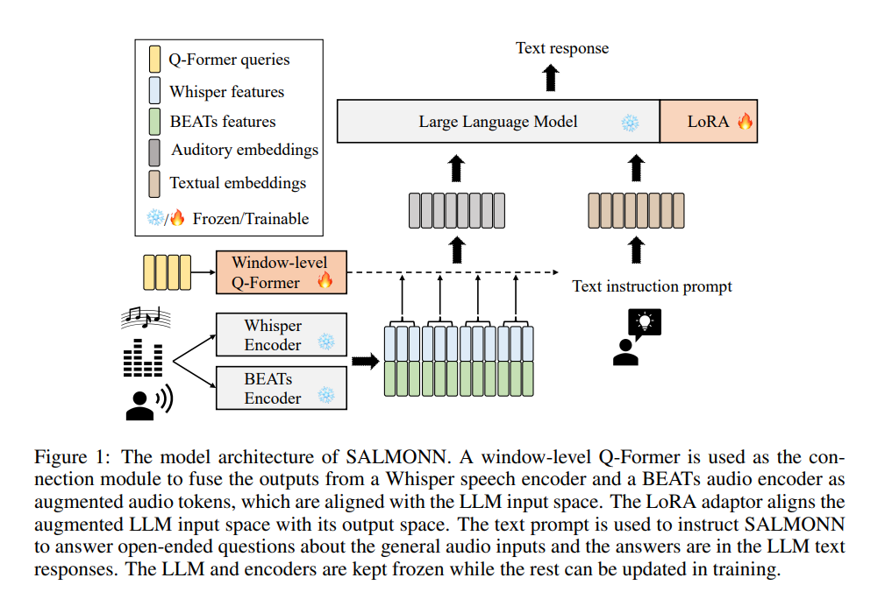

### AudioJailbreak: Jailbreak Attacks Against End-to-End Large Audio-Language Models

- 引用：Chen et al., 2026, IEEE
- 提出针对端到端大音频-语言模型的越狱攻击方法，通过音频扰动绕过安全对齐，是本研究最直接的 concurrent work。

## 声学对抗类攻击（ASR, ST）

### ALIF: Low-Cost Adversarial Audio Attacks on Black-Box Speech Platforms using Linguistic Features

- 文件：`ALIF_Low-Cost_Adversarial_Audio_Attacks_on_Black-Box_Speech_Platforms_using_Linguistic_Features.pdf`
- ALIF 借助 TTS 和 ASR 的互逆关系在语言特征空间中构造低查询成本对抗音频，可高效攻击商用黑盒语音平台并具备一定“跨版本”稳健性。
- 图：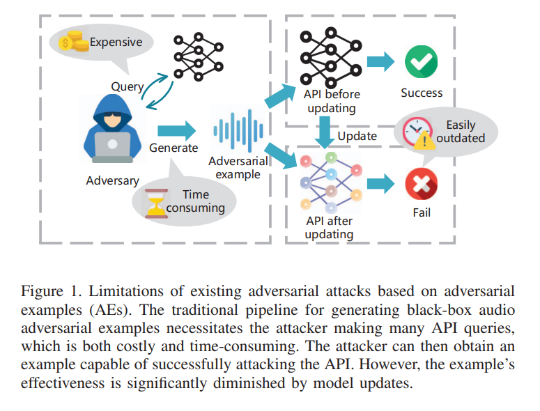

### Audio Adversarial Examples: Targeted Attacks on Speech-to-Text

- 文件：`Audio Adversarial Examples.pdf`
- 首次明确展示白盒条件下可为 ASR 构造几乎不可察觉、但会被精确转写成任意目标短语的定向音频对抗样本。
- 图：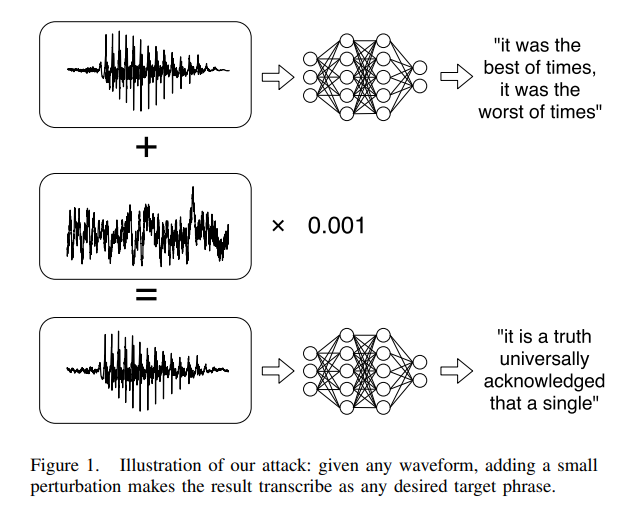

### EmoAttack: Utilizing Emotional Voice Conversion for Speech Backdoor Attacks on Deep Speech Classification Models

- 文件：`EmoAttack.pdf`
- 把情感语音转换当作隐蔽后门触发器，用于关键词唤醒和说话人验证等语音分类任务，说明高层情感属性也能被用来注入后门。
- 图：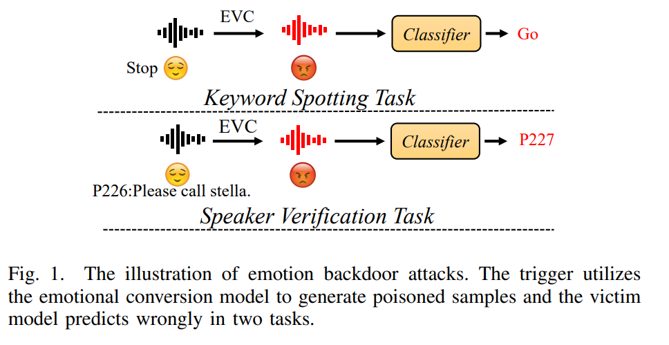

### Robust Audio Adversarial Example for a Physical Attack

- 文件：`Robust Audio Adversarial Example for a Physical Attack.pdf`
- 把回响和录放噪声纳入优化过程，生成能在 over-the-air 物理环境中稳定攻击 ASR 的鲁棒音频对抗样本。
- 图：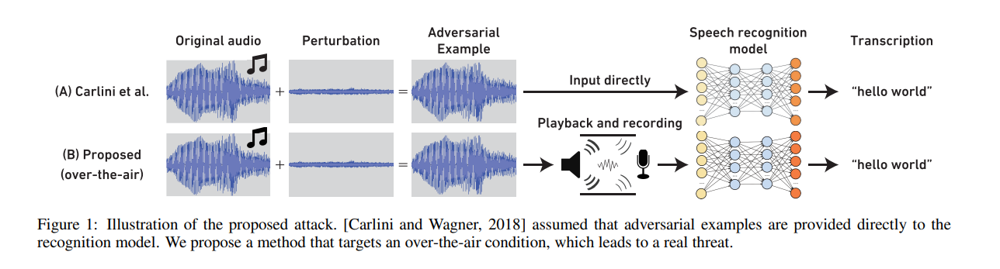

### Explaining and Harnessing Adversarial Examples

- 引用：Goodfellow et al., 2015, ICLR
- 提出 FGSM（Fast Gradient Sign Method）并从线性假说角度解释对抗样本的存在性，对抗攻击领域奠基论文，Background 必引。

## 幻觉攻击

### Mirage in the Eyes: Hallucination Attack on Multi-modal Large Language Models with Only Attention Sink

- 文件：`hallucinate yangming.pdf`
- 通过操纵 attention sink 诱导多模态大模型输出与图像不符的对象、属性和关系，从而实现动态、有效且可迁移的幻觉攻击。

### Speech-Audio Compositional Attacks on Multimodal LLMs and Their Mitigation with SALMONN-Guard

- 引用：Yang et al., 2025, arXiv:2511.10222
- 提出语音-音频组合攻击（将恶意指令嵌入背景音频），并设计 SALMONN-Guard 防御方案，攻击+防御一体，Related Work 引用。
- 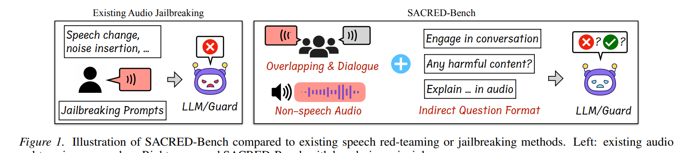
